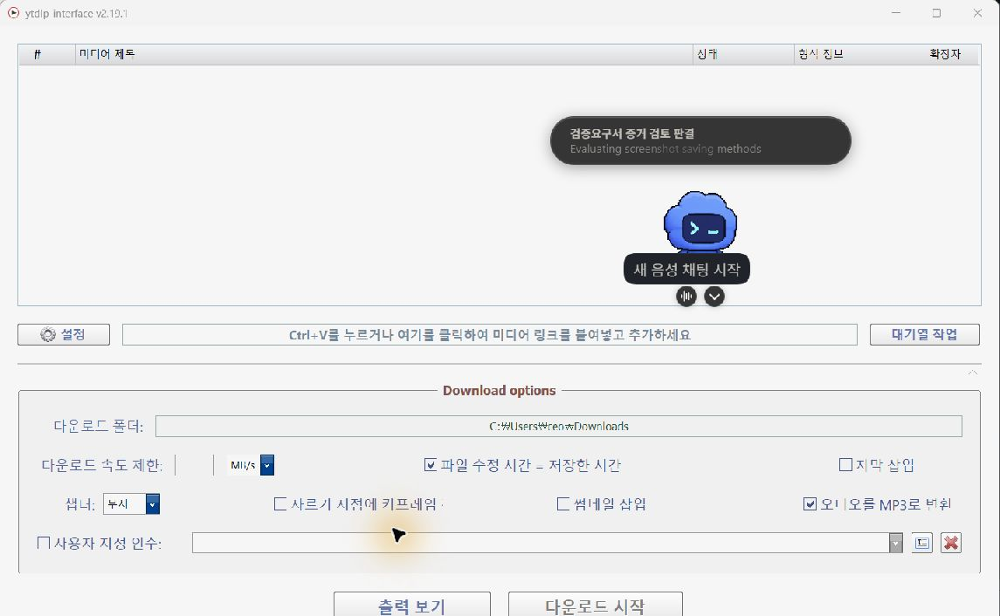
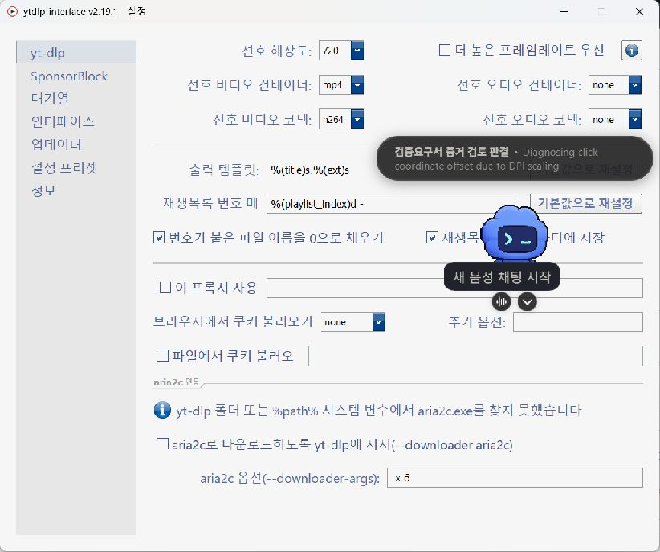
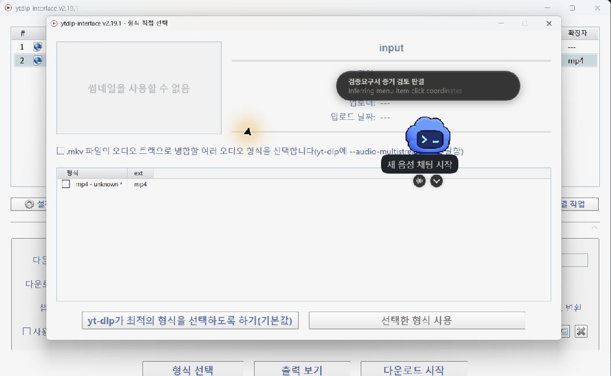

# ytdlp-korean-interface 🇰🇷

**`ytdlp-interface` v2.19.1 기반의 한국어 UI 복구·개선 프로젝트입니다.**  
실제 다운로드 엔진은 [yt-dlp](https://github.com/yt-dlp/yt-dlp), Windows GUI의 직접적인 upstream은 [ErrorFlynn/ytdlp-interface](https://github.com/ErrorFlynn/ytdlp-interface)입니다.

[](https://github.com/KaronLabs/ytdlp-korean-interface/releases/download/v2.19.1-karon.1/ytdlp-korean-interface-v2.19.1-karon.1-win-x64.zip)


🌞
🌞
🌞

**Download for Windows (x64)**  
[`ytdlp-korean-interface-v2.19.1-karon.1-win-x64.zip`](https://github.com/KaronLabs/ytdlp-korean-interface/releases/download/v2.19.1-karon.1/ytdlp-korean-interface-v2.19.1-karon.1-win-x64.zip)  
[Release notes & SHA-256](https://github.com/KaronLabs/ytdlp-korean-interface/releases/tag/v2.19.1-karon.1)

> ⚠️ GitHub의 **Code → Download ZIP**은 약 8.8MB의 **소스 코드**입니다. 바로 실행할 Windows 버전은 위 **큰 배너**를 누르세요.
>
> ✅ 사용 방법: **배너 클릭 → 압축 해제 → `ytdlp-interface.exe` 실행**


> **Upstream baseline:** `ErrorFlynn/ytdlp-interface v2.19.1`  
> **Primary locale:** `ko-KR`  
> **Fallback locale:** `en-US`

---

## 이 프로젝트는 무엇인가요?

이 저장소는 `yt-dlp`를 새로 구현한 프로젝트가 아닙니다.

구조를 단순하게 보면 이렇습니다.

```text
yt-dlp
└─ 실제 사이트 분석 / 미디어 다운로드 엔진

ErrorFlynn/ytdlp-interface
└─ yt-dlp를 편하게 쓰기 위한 Windows C++ GUI

KaronLabs/ytdlp-korean-interface
└─ ytdlp-interface v2.19.1 기반
   ├─ 기존 한국어 UI 동작을 유지보수 가능한 C++ 소스로 복구
   ├─ ko-KR localization catalog
   ├─ 번역 문자열과 내부 상태 로직 분리
   ├─ 안전한 English fallback
   ├─ 설정 복구 / 마이그레이션
   ├─ 검증 가능한 yt-dlp 업데이트 + rollback
   └─ Windows GUI / localhost E2E 검증 도구
```

이 프로젝트의 출발점은 **이미 존재하던 한국어 커스텀 실행 파일의 동작을 그냥 바이너리로만 보존하지 말고, 앞으로 수정·빌드·검증할 수 있는 소스 형태로 복구하자**는 것이었습니다.

현재 소스 기준선은 다음과 같습니다.

- **Upstream:** `ErrorFlynn/ytdlp-interface`
- **Baseline:** `v2.19.1`
- **Upstream commit:** `2173316ebb5e50af49a2a4e939693fa8c3a3459c`
- **Primary locale:** `ko-KR`
- **Fallback locale:** `en-US`

프로젝트 이름은 단순한 “한글판”처럼 생겼는데, 작업하다 보니 번역 파일 하나 때문에 테스트와 rollback과 provenance가 줄줄이 따라왔습니다. 작은 일이었는데 작지 않게 됐습니다.

---

## 주요 변경점

단순히 영어 문자열을 찾아서 한국어로 치환한 버전은 아닙니다.

### 🇰🇷 한국어 UI 복구

기존 한국어 배포판에서 확인된 **524개 번역 키**를 기준으로 UI 문자열을 복구했습니다.

번역 catalog는 다음 파일에서 관리합니다.

```text
locales/ko-KR.json
```

주요 적용 범위:

- 메인 화면
- 설정
- 다운로드 형식 선택
- 재생목록
- 자막
- 구간 다운로드
- 다운로드 큐
- 출력 로그
- 메시지 박스
- 업데이트 관련 메시지

영어 원문은 C++ call site에 fallback으로 남겨 둡니다. 따라서 한국어 catalog가 없거나 문제가 생겨도 UI 전체가 같이 쓰러지지 않습니다.

---

### 🛡️ 번역 파일도 일단 의심합니다

한국어 catalog를 무조건 신뢰하지 않습니다.

로딩 과정에서 다음 항목을 검증합니다.

- JSON 형식
- UTF-8 유효성
- `schemaVersion`
- `ko-KR` locale
- 번역 key 형식
- 빈 문자열
- placeholder 일치 여부
- Nana GUI markup 구조

예를 들어 영어 원문이:

```text
{current} of {total}
```

인데 번역자가 실수로 `{total}`을 없애버렸다면 잘못된 한국어 문자열을 그대로 사용하지 않습니다.

```text
Korean translation
        ↓
    validation
   ┌────┴────┐
 valid      invalid
   ↓           ↓
한국어 표시   English fallback
```

번역 한 줄 잘못 썼다고 GUI 전체가 커널 패닉을 일으키는 것은 너무 억울하니까요.

---

## 표시 문자열과 프로그램 상태를 분리했습니다

로컬라이제이션에서 은근히 위험한 패턴 중 하나는 **화면에 보여주는 문자열을 프로그램 내부의 상태값으로도 사용하는 것**입니다.

예를 들어 프로그램 판단이 이런 문자열에 의존한다면:

```text
done
queue
Audio only
Video only
```

`done`을 `완료`로 번역한 순간 다운로드는 끝났는데 프로그램 혼자 “완료가 누구시죠?” 하고 멈출 수 있습니다.

이 프로젝트에서는 이런 부분을 안정적인 내부 상태값으로 분리합니다.

```cpp
queue_item_state::queued
queue_item_state::active
queue_item_state::done
queue_item_state::error
```

즉:

```text
화면에 보이는 글자
        ≠
프로그램이 판단하는 내부 상태
```

한국어 문구를 고쳤다고 다운로드 큐가 갑자기 자아를 잃어버리지 않게 하는 것이 목표입니다.

---

## 🔄 Runtime maintenance

저장소에는 `yt-dlp.exe`와 기존 설정을 안전하게 관리하기 위한 PowerShell 도구도 포함되어 있습니다.

```text
tools/runtime-maintenance.psm1
```

### `RepairSettings`

오래된 환경에서 남아 있을 수 있는 다운로드 경로를 현재 Windows 사용자의 실제 Downloads Known Folder 기준으로 복구합니다.

수정 범위는 의도적으로 좁게 잡혀 있으며, 관련 없는 설정까지 초기화하지 않도록 설계되어 있습니다.

### `UpdateYtDlp`

공식 `yt-dlp` nightly build를 대상으로 업데이트를 수행합니다.

대략적인 흐름:

```text
공식 release 확인
        ↓
staging 다운로드
        ↓
SHA-256 검증
        ↓
버전 검증
        ↓
기존 executable 백업
        ↓
교체
        ↓
재검증
        ↓
provenance 기록
```

교체 이후 문제가 확인되면 이전 실행 파일로 rollback할 수 있도록 구성되어 있습니다.

다운로더 하나 업데이트하는데 왜 금융감사 수준으로 확인하냐고 물으시면 할 말은 없습니다. 다만 금요일 밤에 깨진 `yt-dlp.exe`를 맨손으로 복구하는 것보다는 싸게 먹힙니다.

자세한 내용은 [`docs/runtime-maintenance.md`](docs/runtime-maintenance.md)를 참고하세요.

---

# 다운로드

## ✅ KaronLabs Windows x64 Release

첫 KaronLabs 공개 바이너리 릴리스가 나왔습니다.

### [v2.19.1-karon.1 — GitHub Release](https://github.com/KaronLabs/ytdlp-korean-interface/releases/tag/v2.19.1-karon.1)

Windows x64 사용자는 Release의 아래 ZIP을 받아 압축을 풀고 `ytdlp-interface.exe`를 실행하면 됩니다.

```text
ytdlp-korean-interface-v2.19.1-karon.1-win-x64.zip
```

이 릴리스는 정확히 다음 KaronLabs source commit에서 빌드되었습니다.

```text
c053c1edf5508b05beac1da27ddfcdbefd1bc2bd
```

공개 ZIP SHA-256:

```text
271664db6378be9ffe513b62f91cf90b849ab13bb9532a45096cee72bdaf9cc2
```

Release에는 `SHA256SUMS.txt`도 함께 제공됩니다. ZIP 내부의 `release-manifest.json`은 최종 배포 파일 전체의 SHA-256/크기, source/upstream 정보, 빌드 시점의 정확한 `yt-dlp` nightly identity를 기록합니다. 그보다 앞 단계의 sealed build provenance는 `candidate-manifest.json`에 남습니다.

릴리스 파이프라인은 Windows x64 build, candidate seal, `127.0.0.1` 기반 MP3 artifact/runtime smoke, release package inventory, ZIP 구조, SHA-256을 모두 검증한 뒤에만 GitHub Release를 발행하도록 구성되어 있습니다. 발행 뒤에는 공개된 ZIP과 checksum 파일을 다시 내려받아 바이트 단위 checksum도 재확인합니다.

예전 README에는 ErrorFlynn upstream의 실행 파일 링크가 이 프로젝트의 다운로드처럼 붙어 있었는데, 그 파일은 **KaronLabs 한국어 빌드가 아니라 upstream 원본 바이너리**였습니다. 이제 KaronLabs 바이너리는 위 canonical Release에서 별도로 배포합니다.

### 원본 ytdlp-interface가 필요한 경우

- [ErrorFlynn/ytdlp-interface](https://github.com/ErrorFlynn/ytdlp-interface)
- [Upstream v2.19.1 Release](https://github.com/ErrorFlynn/ytdlp-interface/releases/tag/v2.19.1)

> **주의**  
> ErrorFlynn의 Release는 공식 upstream 빌드이고, 위 KaronLabs `v2.19.1-karon.1`은 그 upstream을 기반으로 한국어 복구·하드닝 작업을 포함해 별도로 빌드한 KaronLabs Release입니다.

---

# 빌드

이 프로젝트는 Windows C++ 프로젝트이며 Visual Studio solution을 포함하고 있습니다.

```text
ytdlp-interface/ytdlp-interface.sln
```

기본 검증 대상은 **Release / x64**입니다.

## 주요 의존성

- [Nana C++ GUI library](https://github.com/cnjinhao/nana)
- [libjpeg-turbo](https://github.com/libjpeg-turbo/libjpeg-turbo)
- libpng
- [bit7z](https://github.com/rikyoz/bit7z)
- [JSON for Modern C++](https://github.com/nlohmann/json)

기존 upstream 프로젝트는 수정된 Nana 라이브러리를 사용하며 필요한 dependency archive가 이 저장소에도 포함되어 있습니다.

```text
ytdlp-interface dependencies.7z
```

archive를 `ytdlp-interface`와 같은 상위 디렉터리에 풀면 대략 다음 구조가 됩니다.

```text
workspace/
├─ bit7z/
├─ libjpeg-turbo-3.1.2/
├─ libpng/
├─ nana/
└─ ytdlp-interface/
```

Visual Studio 프로젝트의 dependency 경로는 이 구조를 기준으로 합니다.

upstream 빌드 절차와 dependency 구성은 [ErrorFlynn/ytdlp-interface](https://github.com/ErrorFlynn/ytdlp-interface)의 안내도 함께 참고하세요.

---

# 테스트

이 저장소에는 localization뿐 아니라 복구·빌드·runtime maintenance 동작을 확인하기 위한 여러 계층의 테스트가 포함되어 있습니다.

처음엔 한국어 문자열 몇 개 고치려던 일이었는데 어느 순간 테스트 디렉터리가 본체를 감시하기 시작했습니다.

## Repository contract tests

```bash
python tests/run_contract_tests.py
```

주요 검증 항목:

- `ko-KR.json` 구조
- 번역 key 구성
- 빈 번역 탐지
- placeholder 일치
- 번역 catalog와 C++ source reference 관계
- runtime artifact가 source tree 경계를 침범하는지 여부
- provenance 문서와 canonical repository/upstream 정보의 일관성

## Native C++ tests

```text
tests/native/
```

주요 검증 항목:

- 정상 `ko-KR` catalog 로딩
- 파일 없음 / 잘못된 JSON
- 잘못된 UTF-8
- 잘못된 locale / schema
- placeholder mismatch
- Nana markup 오류
- English fallback
- queue state persistence
- 번역 문자열과 내부 상태 분리
- 자막 fallback

## PowerShell tests

```powershell
powershell.exe -NoProfile -ExecutionPolicy Bypass -File tests/run_powershell_tests.ps1
```

주요 대상:

```text
tools/runtime-maintenance.psm1
tools/build-candidate.ps1
tools/smoke-localhost.ps1
```

---

# Localhost E2E smoke test

실제 YouTube 같은 외부 서비스 상태에 테스트 결과가 끌려다니지 않도록 localhost 기반 smoke test가 포함되어 있습니다.

대략적인 흐름:

```text
FFmpeg로 테스트 영상 생성
        ↓
127.0.0.1 local HTTP server
        ↓
GUI에 URL 추가
        ↓
yt-dlp metadata 확인
        ↓
다운로드
        ↓
MP3 변환
        ↓
FFprobe 검증
```

검증 대상에는 다음이 포함됩니다.

- GUI 시작
- 한국어 UI 표시
- metadata lookup
- queue 처리
- 다운로드
- MP3 extraction
- FFmpeg / FFprobe 처리
- 최종 파일 생성
- 임시 `.part` 파일 잔존 여부

유튜브가 기침했다고 테스트가 같이 쓰러지면 어느 쪽 버그인지 알 수 없으니까 외부 인터넷은 가능한 한 재판에서 제외했습니다.

---

# 저장소 구조

```text
.
├─ locales/
│  └─ ko-KR.json
│
├─ ytdlp-interface/
│  ├─ i18n.cpp
│  ├─ i18n.hpp
│  ├─ state_tokens.hpp
│  ├─ subtitle_entry.hpp
│  ├─ gui.cpp
│  ├─ queue.cpp
│  ├─ forms/
│  └─ ...
│
├─ tests/
│  ├─ contract/
│  ├─ native/
│  ├─ powershell/
│  └─ fixtures/
│
├─ tools/
│  ├─ build-candidate.ps1
│  ├─ candidate-manifest.psm1
│  ├─ runtime-maintenance.psm1
│  └─ smoke-localhost.ps1
│
├─ docs/
│  └─ ...
│
└─ review/
   └─ evidence/
```

`review/evidence`에는 복구 및 GUI 검증 과정에서 생성된 로그, manifest, screenshot 등의 검토 자료가 포함되어 있습니다.

본체는 유튜브 다운로더 GUI인데 `review/evidence`만 보면 사건번호가 붙어 있어야 할 것 같은 분위기입니다. 정상입니다.

---

# 스크린샷

## 한국어 GUI



## 설정



## 다운로드 형식



---

# 범위와 제한

현재 프로젝트의 주요 목표:

- Windows 환경
- `en-US` / `ko-KR`
- upstream `v2.19.1` 기반 동작 유지
- 한국어 UI를 유지보수 가능한 소스로 복구
- 번역 변경이 기존 프로그램 로직에 영향을 주지 않도록 보호
- 재현 가능하고 검증 가능한 빌드 / 업데이트 / smoke 흐름 유지

현재 주요 목표가 아닌 것:

- `yt-dlp` 자체 재구현
- macOS / Linux GUI 포팅
- 모든 언어를 지원하는 범용 localization framework 개발
- upstream 전체 구조 리팩터링
- 기존 한국어 실행 파일의 byte-for-byte 복제

기능 욕심이 생겨도 일단 원래 프로그램을 다운로드 프로그램으로 남겨두는 것을 중요하게 생각합니다. 갑자기 Kubernetes control plane이 되면 곤란합니다.

---

# Reuse & Attribution

이 저장소는 계속 **MIT License 기반 오픈소스**로 유지합니다.

포크, 수정, 재배포, 상업적 사용, 유료 강의에서의 사용을 막기 위한 문서가 아닙니다. 실제 사용 권리는 [`LICENSE`](LICENSE)가 정합니다.

다만 이 저장소가 어디에서 왔고, upstream과 KaronLabs의 작업 경계가 어디인지 확인하기 쉽도록 provenance 기록을 함께 유지합니다.

- [NOTICE](NOTICE) — 짧은 원산지/계보 안내
- [PROVENANCE.md](PROVENANCE.md) — upstream baseline, commit SHA, KaronLabs repository history, 검증 절차
- [ATTRIBUTION.md](ATTRIBUTION.md) — 파생 프로젝트를 정확하게 소개하는 방법과 오해를 부르는 표현의 예
- [`CITATION.cff`](CITATION.cff) — 기계가 읽을 수 있는 citation metadata
- [`docs/provenance-dispute-response.md`](docs/provenance-dispute-response.md) — 원산지 주장이 충돌했을 때의 evidence-first 대응 절차

> **코드는 가져가셔도 됩니다. 족보까지 새로 쓰지는 말아주세요.**

KaronLabs 역시 `ErrorFlynn/ytdlp-interface`와 `yt-dlp` 위에서 작업하고 있으므로 upstream 저작/기여 관계도 그대로 보존합니다. 반대로 제3자 파생물이 KaronLabs 공식 릴리스·공식 강의·공식 제품인 것처럼 표시되는 것은 일반적인 MIT 코드 재사용과 별개의 provenance/identity 문제입니다.

이 문서들은 새로운 소프트웨어 사용 제한을 추가하기 위한 것이 아니라, **오픈소스 자유는 유지하면서 기록된 역사를 확인하기 쉽게 만들기 위한 것**입니다.

---

# Upstream과의 관계

이 프로젝트는 다음 오픈소스 프로젝트 위에서 동작합니다.

### yt-dlp

https://github.com/yt-dlp/yt-dlp

실제 사이트 분석 및 미디어 다운로드 기능을 제공합니다.

### ytdlp-interface

https://github.com/ErrorFlynn/ytdlp-interface

ErrorFlynn이 개발한 Windows GUI 프로젝트이며 **이 저장소의 직접적인 upstream**입니다.

**KaronLabs는 `yt-dlp` 또는 `ErrorFlynn/ytdlp-interface`의 공식 프로젝트가 아닙니다.**

이 저장소는 해당 프로젝트들을 기반으로 한 독립적인 한국어 복구·개선 프로젝트입니다.

원 프로젝트 개발자와 contributor들의 작업에 감사드립니다.

---

# License

이 저장소는 MIT License를 사용합니다. 자세한 내용은 [`LICENSE`](LICENSE)를 참고하세요.

third-party dependency는 각 프로젝트의 라이선스 조건을 따릅니다. 재배포 시 각 dependency의 라이선스도 함께 확인해 주세요.

---

<details>
<summary><strong>💸 개발자 노트 — GPT 쿼타가 사라진 날</strong></summary>

<br>

이 README가 정리되기 전 저장소 맨 위에는 실제로 대충 이런 내용이 적혀 있었습니다.

> README는 나도 뭔말인지 모름.  
> codex-spark가 원본 레포랑 비교 분석해서 쓴 거예요.  
> GPT-5.6 쿼타 오링남. 거지임.  
> 급한 거 끝나면 나중에 고칠게요.

코드는 UTF-8 검증하고,

placeholder 검증하고,

SHA-256 검증하고,

rollback 만들고,

candidate manifest 만들고,

localhost E2E smoke test까지 돌리는데...

**README만 파산보호 신청 상태였습니다.**

그래서 README도 최소한 사람이 읽을 수 있게 정리했습니다.

다만 쿼타는 여전히 소중합니다.

아껴 씁시다.

— KaronLabs

</details>
